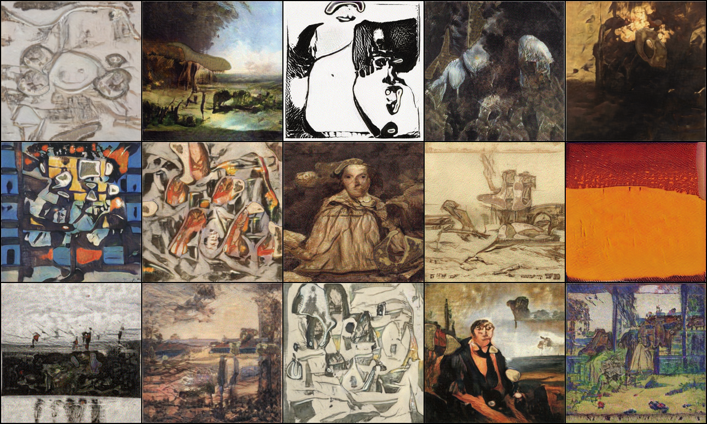
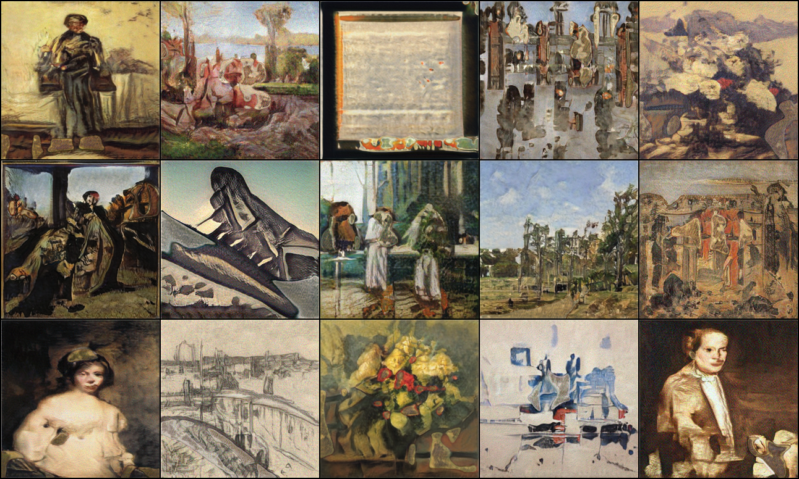
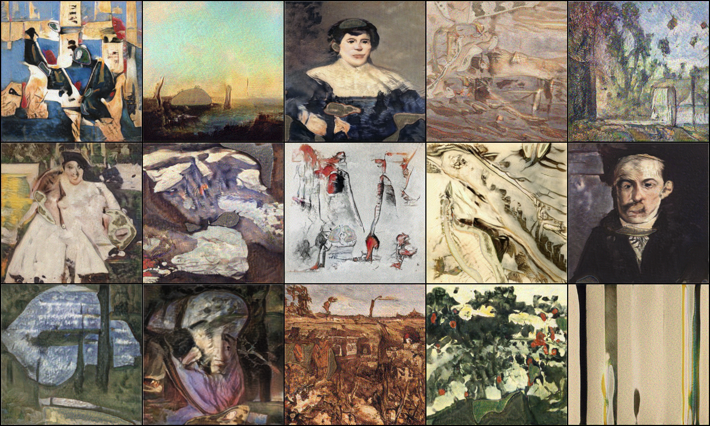

# Creative Walk Adversarial Networks: Novel Art Generation with Probabilistic Random Walk Deviation from Style Norms
This repository contains the implementation of CWAN loss applied on StyleGAN2. The implementation of StyleGAN2 is borrowed from [rosinality/stylegan2-pytorch](https://github.com/rosinality/stylegan2-pytorch) 

## Requirements

I have tested on:

* PyTorch 1.3.1
* CUDA 10.1/10.2

## Usage

First download the wikiart dataset from [here](https://www.dropbox.com/s/ssw0fdcdld50o1g/wikiartimages.zip/).

Extract the data in the root directory.

Then you can train model in distributed settings

```bash
python -m torch.distributed.launch --nproc_per_node=4 --master_port=12895 train.py\
        --batch=32\ #batch size
        --checkpoint_folder=styleGAN2\ # folder to save checkpoint to
        --n_sample=25\ # intermediate samples to save
        --size=256\ # generation size
        --name_suffix=RW-W10-T10\ # checkpoint suffix
        --use_RW\ # whether to use CWAN loss
        --normalize_protos_scale=3.0\ # scale of normalization of protos
        --RW_weight=10.0\ # Scale of CWAN loss
        --RW_tau=10\ # Number of steps T
        --wandb\ # whether to use weight and biases logging
        --no_pbar\ # no progress bar when in batch mode, useful in cases of HPCs
```

## Samples






## License

Model details and custom CUDA kernel codes are from official repostiories: https://github.com/NVlabs/stylegan2

Codes for Learned Perceptual Image Patch Similarity, LPIPS came from https://github.com/richzhang/PerceptualSimilarity

To match FID scores more closely to tensorflow official implementations, I have used FID Inception V3 implementations in https://github.com/mseitzer/pytorch-fid
